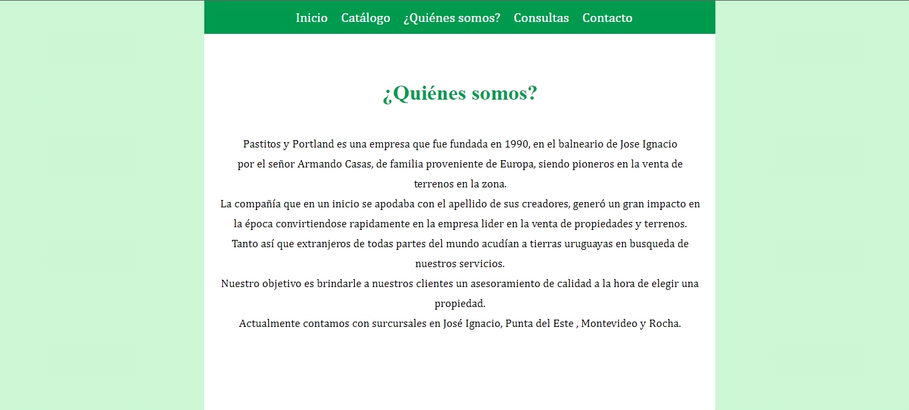
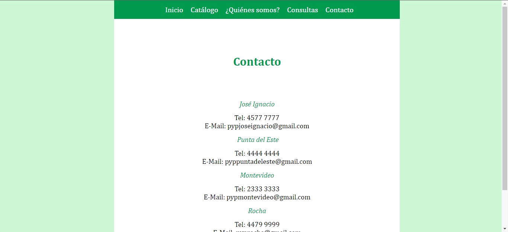

# P&P: Página Web Ilustrativa
Es un sitio web ilustrativo sencillo que muestra la información de una agencia inmobiliaria. 

## Contenido 
La página web contiene las siguientes secciones:
- Home con carrusel de fotos.
- Catálogo de propiedades y sus precios.
- Sección de ¿Quienes somos?.
- Formulario de contacto.

## Tecnlogías utilizadas
- JavaScript
- HTML
- CSS

## Capturas 

## Nota
Este sitio web se realizó con el objetivo de incorporar los conceptos de Usabilidad y Accesibilidad Web, además de aplicar buenas prácticas al trabajar
con los lenguajes de programación HTML, Css y JavaScript.

